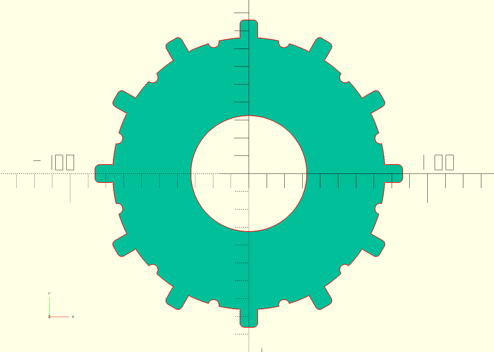

# Vented baffles
Vented refractor baffle design in OpenScad for laser cutting of a thin aluminum sheet.
The design is parametric. The tabs are meant to be bent and maintain the baffle in place.

Use:
1- Go here for baffle calculation:
https://github.com/erellaz/Baffle_calculator

2- Modify the Openscad file provided here for the size of your baffle opening and tube inside diameter.

3- Export as dxf.

4- repeat for each baffle and send the dxfs to your laser cut provider.

